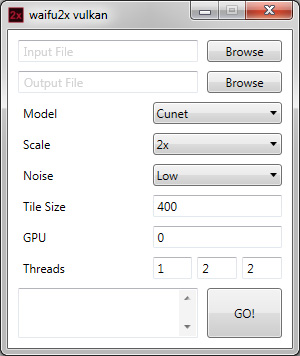

# waifu2x-ncnn-vulkan-simple-gui

Simple user interface for [waifu2x-ncnn-vulkan](https://github.com/nihui/waifu2x-ncnn-vulkan)

## Preview

## How to

Place `waifu2x-vulkan-gui.exe` into the `waifu2x-ncnn-vulkan` directory and that's it.

Note: .NET 4.5 is required.

## Example

*Comparsion between regular upscaled image on the left and waifu2x upscaled image on the right*

## See more

- [waifu2x](https://github.com/nagadomi/waifu2x)
- [waifu2x-ncnn-vulkan](https://github.com/nihui/waifu2x-ncnn-vulkan)
